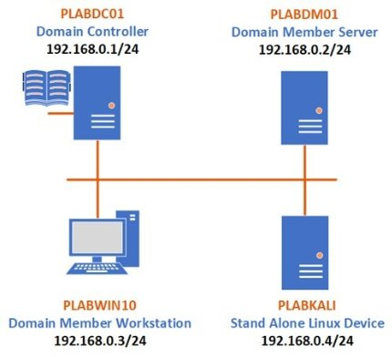

**Practical Work Experience and Portfolio Building**

` `**Evidence Reporting Document**

- **Introduction**

*The main goal of this document is to keep track of the practical hands-on work experience and lab challenges you will complete throughout the program. By doing so, at the end of the program, you will have a great portfolio that you can use for evidence of your practical skills, and you can also come back for review whenever needed. This evidence is essential in the long run and keeps you on track with the time you will spend on your career upgrade process. These notes will also play a vital role in identifying the skills and tools to reflect on your marketing materials like your CV/resume or LinkedIn Page.*

- **General Details**

**Date: 24 April 2024**

**Your Name: LOK HIM TAM (Himson)**

**Email-address:** himsom0528@gmail.com**                                                                                               

**Name of the Challenge:** CompTIA Security+ Identifying Different Cyber Attacks

**Access Details (URL or source):**  CompTIA Security+
**

**Details of the Challenge:**

In this lab I have working following exercise:

- Exercise 1 – Malware
- Exercise 2 - Creating Standalone Payloads with Msfvenom
- Exercise 3 - Performing Online Password Attacks
- Exercise 4 - Performing Offline Password Attacks
- Exercise 5 - Explaining Physical and Other Attacks

I have worked on the following tasks:

- Create a Fork Bomb as a Simple Virus
- Switch Off the Windows Firewall
- Turn off the Windows Defender Real-time Protection
- Create a Payload
- Share the Payload with the Victim
- Use the Multi/handler Module and Exploit the System
- Create a User Account in FTP
- Use Wordlists
- Use Hydra to Guess Usernames and Passwords
- Crack Linux Passwords using John the Ripper
- Use ncrack in Kali Linux
- Generate Rainbow Tables

Also, I have basic understand of the following topic:

- Types of Malware
- Spraying
- Plaintext/Unencrypted
- Malicious Universal Serial Bus (USB) Cable
- Malicious Flash Drive
- Card Cloning / Skimming
- Adversarial Artificial Intelligence (AI)
- Supply-chain Attacks
- Cloud-based vs. On-premise Attacks
- Cryptographic Attacks

**Lab Topology**

In this lab, I have learned how to control the following server and Operation system: 

**

- **Challenge Details**

**Before starting the challenge:**

1. Be sure that the lab is in the scope of your niche.
1. You have enough time to solve the full lab or have a proper plan to solve a part of it and complete the remaining sections later.
1. Try to build a good learning environment with less distraction for at least 30 minutes to an hour.

**After completing the challenge:**

1. Were you able to finish the lab? Did you need extra time? Was the lab relevant to your expectations? Did you need additional help to solve the lab?
- Yes I am able to finish the lab within 1 hour. It is relevant to my expectations. And I can finish it without additional help.

1. Write down your learning outcomes, skills you developed or improved and the tools you used in this challenge.

   *(You may use the keywords listed in the lab details or add your own skills that you think you acquired.)*

- Exercise 1 – Malware
  - I learnt about malware and various types of malware. You will also create a fork bomb.
- Exercise 2 - Creating Standalone Payloads with Msfvenom
  - I created a standalone payload with Msfvenom and deploy it on the targeted host for exploitation. 
  - How to start a simple server and server payload to Victim
  - How to use msfconsole and setup target host
  - How to control victim computer by using meterpreter
- Exercise 3 - Performing Online Password Attacks
  - I learned about performing an online password attack.
  - I learned how to create User account in FTP by using xampp
  - How to create wordlist of a list of passwords by using cewl
  - Learn how to use hydra tool to guess usernames and passwords
- Exercise 4 - Performing Offline Password Attacks
  - I learn about performing an offline attack
  - I learned how to crack Linux Passwords using John the Ripper
  - I learned how to use ncrack to crack password using a wordlist
  - I learn how to create MD5 Rainbow tables by using Winrtgen
  - I learn how to use **Cain & Abel** (password cracking utility) to recover passwords from various sources, such as local and wireless systems.
- Exercise 5 - Explaining Physical and Other Attacks
  - I learned different type and knowledge of physical attack.

The tools or command line that I have learned in this lab:

- fork bomb
- Msfvenom
- Windows Defender Firewall
- Meterpreter
- Xampp
- Cewl command in Kail Linux
- Hydra
- Recover Windows Hashes using Cain and Abel
- John the Ripper Kail Linux Command Line Tool
- Ncrack Kail Linux Command Line Tool
- Winrtgen (MD5 Rainbow tables)
- Cain & Abel
1. Prepare a self-reflection and reporting video using any screen recording tool (like Loom) and share the link.

   *(The report may include but is not limited to your thoughts about the problem solved, difficulties encountered, any notes to discuss with your peers, anything to ask the mentors and last but not least how it may help you in your ideal job. Please prepare the summary in a way that you are presenting this to your managers and colleagues in your ideal workplace)*

   **URL:**

   [**https://www.loom.com/share/743a6797104e41e4884f23d5d403a93d?sid=71211523-e80f-4ff6-96ac-dd49f0db3242**](https://www.loom.com/share/743a6797104e41e4884f23d5d403a93d?sid=71211523-e80f-4ff6-96ac-dd49f0db3242)

