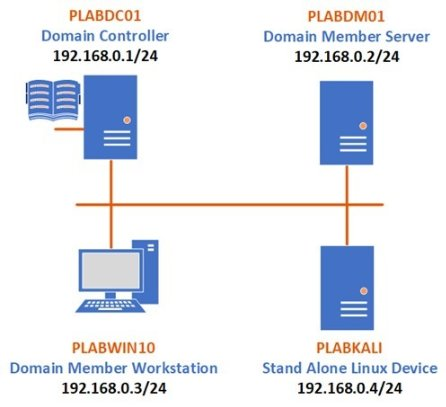

**Practical Work Experience and Portfolio Building**

` `**Evidence Reporting Document**

- **Introduction**

*The main goal of this document is to keep track of the practical hands-on work experience and lab challenges you will complete throughout the program. By doing so, at the end of the program, you will have a great portfolio that you can use for evidence of your practical skills, and you can also come back for review whenever needed. This evidence is essential in the long run and keeps you on track with the time you will spend on your career upgrade process. These notes will also play a vital role in identifying the skills and tools to reflect on your marketing materials like your CV/resume or LinkedIn Page.*

- **General Details**

**Date: 25 April 2024**

**Your Name: Lok Him Tam (Himson)**

**Email-address: himsom0528@gmail.com****                                                                                                

**Name of the Challenge: Social Engineering Techniques and Exploits**

**Access Details (URL or source): CompTIA Security+**

**Details of the Challenge:**

You completed the following exercises:

- Exercise 1 - Social Engineering
- Exercise 2 - Social Engineering Principles
- Exercise 3 - Reconnaissance

You should now be able to:

- Perform DNS Querying
- Use Recon-ng
- Use theHarvester
- Identify Live Hosts on a Network
- Perform Discovery Scans
- Perform Port Scanning
- Fingerprint a System

You should now have further knowledge of:

- Phishing
- Phishing and its Types
- Phishing Methods
- Phishing Process
- Reasons for Successful Phishing Attacks
- Social Engineering Motivation Techniques
- Typosquatting
- Hoax, Baiting, Shoulder Surfing, and Tailgating
- Dumpster Diving
- Spamming
- SPIM
- Identity Theft
- Invoice Scams
- Credential Harvesting
- Influence Campaigns
- Impersonation
- Eliciting Information
- Reconnaissance Terminology
- Tools Used in Reconnaissance
- Need for Reconnaissance or Footprinting

**Lab Topology**

In this lab, I have learned how to control the following server and Operation system: 

**

- **Challenge Details**

**Before starting the challenge:**

1. Be sure that the lab is in the scope of your niche.
1. You have enough time to solve the full lab or have a proper plan to solve a part of it and complete the remaining sections later.
1. Try to build a good learning environment with less distraction for at least 30 minutes to an hour.

**After completing the challenge:**

1. Were you able to finish the lab? Did you need extra time? Was the lab relevant to your expectations? Did you need additional help to solve the lab?
- Yes I can finish the lab within a hour. I don’t need additional help to solve the lab

1. Write down your learning outcomes, skills you developed or improved and the tools you used in this challenge.

   *(You may use the keywords listed in the lab details or add your own skills that you think you acquired.)*

- Exercise 1 - Social Engineering
  - I have learnt the knowledge of:
    - Phishing
    - Phishing and its Types
    - Phishing Methods
    - Phishing Process
    - Reasons for Successful Phishing Attacks
- Exercise 2 - Social Engineering Principles
  - I have learnt the knowledge of:
    - Social Engineering Motivation Techniques
    - Typosquatting
    - Hoax, Baiting, Shoulder Surfing, and Tailgating
    - Dumpster Diving
    - Spamming
    - SPIM
    - Identity Theft
    - Invoice Scams
    - Credential Harvesting
    - Influence Campaigns
    - Impersonation
    - Eliciting Information
- Exercise 3 – Reconnaissance
  - I have learnt the knowledge of:
    - Reconnaissance Terminology
    - Tools used in Reconnaissance
    - Need for Reconnaissance or Foot printing
  - I can do the following:
    - Perform DNS Querying
    - Use Recon-ng
    - Use theHarvester
    - Identify Live Hosts on a Network
    - Perform Discovery Scans
    - Perform Port Scanning
    - Fingerprint a System

1. Prepare a self-reflection and reporting video using any screen recording tool (like Loom) and share the link.

   *(The report may include but is not limited to your thoughts about the problem solved, difficulties encountered, any notes to discuss with your peers, anything to ask the mentors and last but not least how it may help you in your ideal job. Please prepare the summary in a way that you are presenting this to your managers and colleagues in your ideal workplace)*

   **URL:**

   [**https://www.loom.com/share/2f3510cb935742f4b0d3c61b9a0c9168?sid=3526c8b4-6898-4136-a8ed-cfc21a16a97c**](https://www.loom.com/share/2f3510cb935742f4b0d3c61b9a0c9168?sid=3526c8b4-6898-4136-a8ed-cfc21a16a97c)

